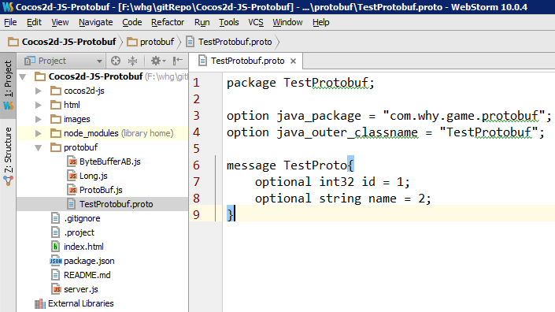
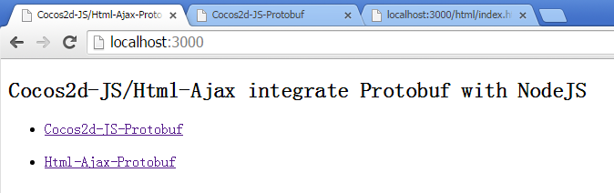
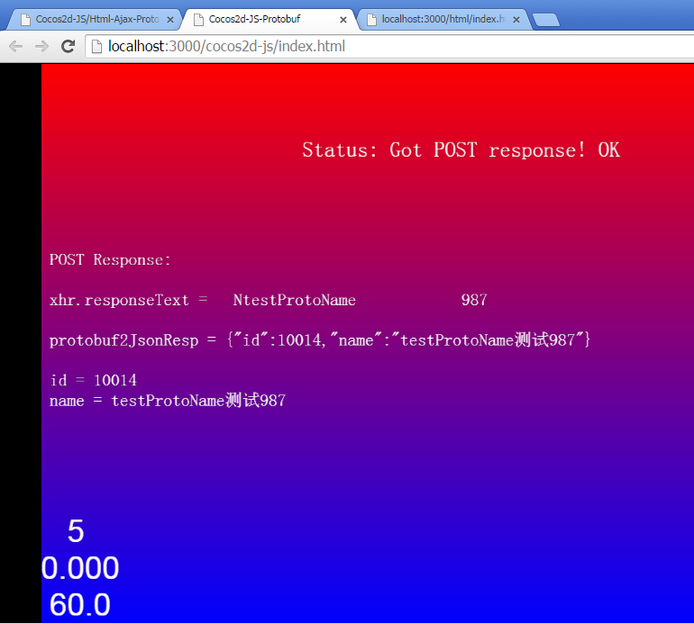
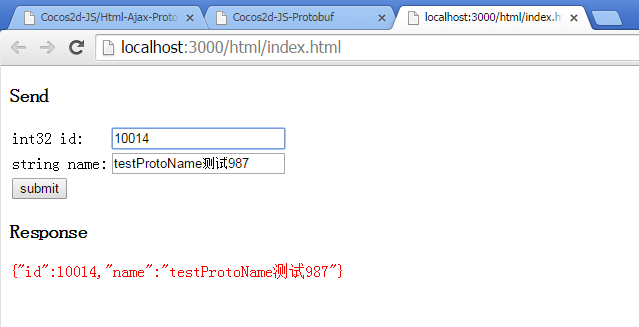
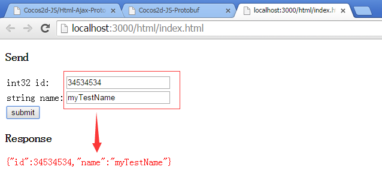

# Cocos2d-JS-Protobuf
This example shows how to use cocos2d-js/html-ajax to transfer protocol buffers in HTTP

## Instructions
1. Set up dependencies: `npm install`
2. Copy the cocos2d-js `frameworks` to cocos2d-js directory
3. Run: `node server.js`
4. Open `http://localhost:3000` in a recent browser

## Snapshots
below is the TestProtobuf.proto

you will see below Snapshots when you visit `http://localhost:3000`

you can click the link to visit Cocos2d-JS-Protobuf or Html-Ajax-Protobuf as below

